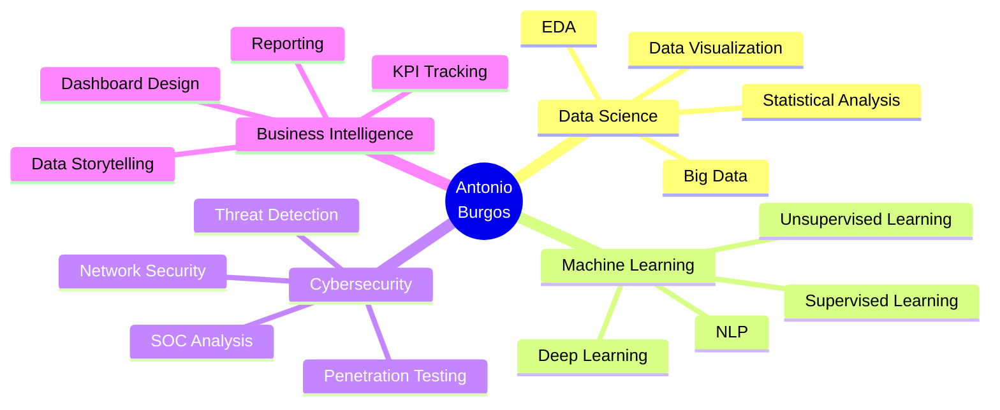

<div align="center">

# 👋 ¡Hola! Soy Antonio Burgos


[](https://www.linkedin.com/in/antonio-burgos91/)
[](mailto:burgosbriales@hotmail.com)
[](https://github.com/AntonioBurgos91)


</div>

---

## 🚀 Sobre mí

Científico de Datos y Especialista en IA con pasión por transformar datos complejos en soluciones innovadoras. Combino expertise en **Machine Learning**, **Data Analytics** y **Ciberseguridad** para crear sistemas inteligentes y seguros.

```python
class DataScientist:
    def __init__(self):
        self.name = "Antonio Burgos"
        self.role = "Data Scientist & AI Specialist"
        self.location = "España"
        self.skills = {
            "languages": ["Python", "SQL", "R"],
            "ml_frameworks": ["TensorFlow", "PyTorch", "Scikit-Learn"],
            "data_tools": ["Pandas", "NumPy", "Matplotlib", "Seaborn"],
            "bi_tools": ["Power BI", "Tableau", "Plotly"],
            "cybersecurity": ["Kali Linux", "Wireshark", "OWASP"],
            "cloud": ["AWS", "Docker"],
        }

    def say_hi(self):
        print("¡Transformemos datos en valor!")

me = DataScientist()
me.say_hi()
```

---

## 🛠️ Tech Stack

<div align="center">

### 💻 Languages


### 🤖 Machine Learning & AI


### 📊 Data Science & Analytics


### 📈 Business Intelligence


### 🔒 Cybersecurity


### ☁️ Cloud & DevOps


</div>

---

## 🏆 GitHub Trophies

<div align="center">

[](https://github.com/AntonioBurgos91)

</div>

---

## 📊 GitHub Stats

<div align="center">


</div>

---

## 🚀 Proyectos Destacados

<div align="center">

| 🎯 Proyecto | 📝 Descripción | 🛠️ Tech Stack | ⭐ Stars |
|------------|---------------|---------------|---------|
| **[AI Vision Assistant](https://github.com/AntonioBurgos91/ai-vision-assistant)** | Asistente inteligente con capacidades de visión por computadora powered by Claude AI | `Python` `AI` `Computer Vision` `Claude API` |  |
| **[Análisis Climático ML](https://github.com/AntonioBurgos91/Analisis-Climatico-MachineLearning)** | Análisis del cambio climático con ML aplicado a datos históricos desde 1880 | `Python` `ML` `Climate Analysis` `Visualization` |  |
| **[SOC Log Analyzer](https://github.com/AntonioBurgos91/SOC-Log-Analyzer)** | Sistema profesional de análisis de logs de seguridad con detección de amenazas en tiempo real | `Python` `Security` `Real-time Analysis` |  |
| **[Atlas GRC](https://github.com/AntonioBurgos91/atlas-grc)** | Plataforma empresarial de cumplimiento ISO 27001 y cuantificación de riesgos | `ISO 27001` `Risk Management` `Compliance` |  |
| **[Real Estate Insights](https://github.com/AntonioBurgos91/real-estate-data-insights)** | Análisis completo del mercado inmobiliario con modelos predictivos de precios | `Python` `ML` `Real Estate` `Predictive Models` |  |
| **[Breast Cancer Classification](https://github.com/AntonioBurgos91/breast-cancer-classification)** | Clasificación de tejido mamario con ML (benigno/maligno) | `Scikit-Learn` `XGBoost` `Healthcare ML` |  |
| **[Diabetes Prediction](https://github.com/AntonioBurgos91/modelo_diabetes_ml)** | Predicción de diabetes tipo 2 con Machine Learning aplicado a datos clínicos | `Scikit-Learn` `Healthcare` `Predictive Analytics` |  |
| **[Banking Financial EDA](https://github.com/AntonioBurgos91/banking-financial-eda-sql-python)** | Análisis exploratorio de métricas financieras y riesgo crediticio | `SQL` `Python` `Plotly` `Financial Analysis` |  |
| **[Network Traffic Detector](https://github.com/AntonioBurgos91/Network_Traffic_Detector)** | Clasificación de tráfico de red mediante Machine Learning | `Scikit-Learn` `Network Security` `ML` |  |

</div>

---

## 📈 Contribution Graph

<div align="center">

[](https://github.com/AntonioBurgos91)

</div>

---

## 🎓 Certificaciones Profesionales

<div align="center">

| 🏅 Certificación | 🏛️ Institución | 🔗 Link |
|-----------------|---------------|---------|
| Google Data Analytics | Google | [](https://www.coursera.org/account/accomplishments/specialization/certificate/google-data-analytics) |
| IBM Data Science Professional Certificate | IBM | [](https://www.coursera.org/professional-certificates/ibm-data-science) |
| IBM SkillsBuild Analytics Certificate | IBM | [](https://skillsbuild.org) |
| Guided Learning Experience in AI | IBM | [](https://www.ibm.com) |
| Certificado Profesional de Ciberseguridad | Google | [](https://www.coursera.org/google-certificates/cybersecurity-certificate) |
| Curso Básico de Ciberseguridad | INCIBE | [](https://www.incibe.es) |
| Google IT Automation with Python | Google | [](https://www.coursera.org/professional-certificates/google-it-automation) |

</div>

---

## 💼 Áreas de Expertise

<div align="center">



</div>

---

## 📫 Conecta Conmigo

<div align="center">

[](https://www.linkedin.com/in/antonio-burgos91/)
[](mailto:burgosbriales@hotmail.com)
[](https://github.com/AntonioBurgos91)
[](https://github.com/AntonioBurgos91)

</div>

---

<div align="center">

### 💡 Filosofía

> *"Los datos son el nuevo petróleo, pero solo si sabes refinarlos"*

### ⚡ Fun Fact

*Transformando café en código y datos en insights desde 2020*

---


**🌟 Si te gusta mi trabajo, no olvides darle una estrella ⭐ a mis repositorios**


</div>
