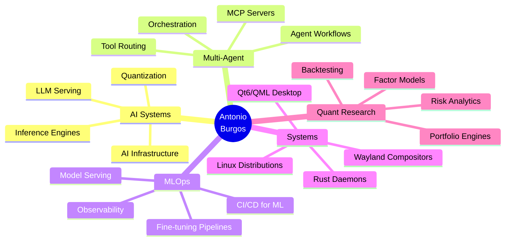

<div align="center">

# 👋 Hi, I'm Antonio Burgos


[](https://www.linkedin.com/in/antonio-burgos91/)
[](mailto:burgosbriales@hotmail.com)
[](https://github.com/AntonioBurgos91)


</div>

---

## 🚀 About me

I build **complete AI systems and infrastructure** — from kernel-level Linux tuning to multi-agent orchestration in production.

Most "AI engineers" wire APIs together. I build the layer underneath: the operating system, the inference runtime, the orchestration logic, the observability.

End-to-end ownership of the stack.

```rust
struct AIEngineer {
    name: &'static str,
    role: &'static str,
    location: &'static str,
    focus: [&'static str; 5],
}

impl AIEngineer {
    fn current() -> Self {
        Self {
            name: "Antonio Burgos",
            role: "AI Systems Engineer · Creator of AurumOS",
            location: "Palma de Mallorca, Spain",
            focus: [
                "AI infrastructure (C++23 / Rust / Python)",
                "LLM serving (vLLM, SGLang, Ollama)",
                "Multi-agent orchestration (Claude, MCP)",
                "MLOps & observability (Langfuse, Phoenix)",
                "Quantitative research (factor models)",
            ],
        }
    }

    fn philosophy(&self) -> &'static str {
        "If the tooling doesn't exist, I build it."
    }
}
```

---

## 🟡 Featured project — AurumOS

> **The Linux distribution for AI engineers.**
> Production-grade · macOS-Sequoia-class UX · adapts to your hardware.

[](https://github.com/AntonioBurgos91/aurum-os)
[](https://github.com/AntonioBurgos91/aurum-os/blob/main/LICENSE)
[](https://github.com/AntonioBurgos91/aurum-os)
[](https://github.com/AntonioBurgos91/aurum-os)
[](https://github.com/AntonioBurgos91/aurum-os/stargazers)

A full Linux distribution. Built solo. ~50K LOC across **C++23, Rust, QML, Python and Bash**.

- 🖥️ Custom **Qt6/QML desktop environment** — 12 native apps + 3 Rust daemons over D-Bus
- ⚡ Forked **Hyprland compositor** tuned for GPU workloads (zero variance during training)
- 🎯 **Hardware-tier adaptive** — auto-detects GPU and adjusts every launcher (vLLM, Ollama, ComfyUI, fine-tuning scripts)
- 🧠 **SOTA 2026 AI stack** pre-wired: vLLM · Unsloth · DSPy · MCP · LiteLLM · Langfuse · Continue.dev · ComfyUI · YOLOv11 · SAM 2
- 📦 **Steam-Workshop-style Model Pack Manager** (6 curated bundles)
- 🧪 **5-stage CI + 52-check smoke harness**
- 🐧 Forked from **Pop!_OS 24.04 LTS** for NVIDIA / CUDA / cuDNN / TensorRT inheritance

➡️ **[github.com/AntonioBurgos91/aurum-os](https://github.com/AntonioBurgos91/aurum-os)** · ⭐ if it resonates

---

## 🛠️ Tech Stack

<div align="center">

### 💻 Languages


### 🧠 AI Infrastructure & LLM


### 🐧 Systems & Infrastructure


### 📊 Data & BI


### 🔄 Workflow & Automation


</div>

---

## 🚀 Selected Projects

<div align="center">

| 🎯 Project | 📝 What it is | 🛠️ Stack |
|---|---|---|
| **[AurumOS](https://github.com/AntonioBurgos91/aurum-os)** ⭐ | Full Linux distribution for AI engineers · custom Qt6/QML desktop · SOTA 2026 AI stack · hardware-adaptive | `C++23` `Rust` `QML` `Python` `Bash` |
| **QuantumScore** | Factor-based portfolio engine with backtesting · 5-pillar scoring · CAGR +101.4% / Sharpe 2.07 (validated strategy) | `Python` `React` `Vite` `Backtesting` |
| **Inmobiliaria Palma** | Real-estate finder · 5D scoring · 6K+ listings · undervaluation detection | `Flask` `SQLite` `Leaflet` `Telegram API` |
| **[AI Vision Assistant](https://github.com/AntonioBurgos91/ai-vision-assistant)** | Vision assistant powered by Claude API | `Python` `Claude API` `CV` |
| **[SOC Log Analyzer](https://github.com/AntonioBurgos91/SOC-Log-Analyzer)** | Real-time security log analysis & threat detection | `Python` `Security` |
| **[Atlas GRC](https://github.com/AntonioBurgos91/atlas-grc)** | ISO 27001 compliance & risk quantification platform | `ISO 27001` `Risk` |

</div>

---

## 🎓 Certifications

<div align="center">

| 🏅 Certification | 🏛️ Institution |
|---|---|
| Google Data Analytics Professional Certificate | Google |
| IBM Data Science Professional Certificate | IBM |
| IBM SkillsBuild Analytics Certificate | IBM |
| Guided Learning Experience in AI | IBM |
| Google Cybersecurity Professional Certificate | Google |
| Google IT Automation with Python | Google |
| Curso Básico de Ciberseguridad | INCIBE |

</div>

---

## 💼 Areas of expertise

<div align="center">


```mermaid
mindmap
  root((Antonio<br/>Burgos))
    AI Systems
      AI Infrastructure
      LLM Serving
      Inference Engines
      Quantization
    Multi-Agent
      Orchestration
      MCP Servers
      Tool Routing
      Agent Workflows
    MLOps
      Observability
      Fine-tuning Pipelines
      Model Serving
      CI/CD for ML
    Systems
      Linux Distributions
      Qt6/QML Desktop
      Rust Daemons
      Wayland Compositors
    Quant Research
      Factor Models
      Backtesting
      Portfolio Engines
      Risk Analytics
```

</div>

---

## 📫 Connect

<div align="center">

[](https://www.linkedin.com/in/antonio-burgos91/)
[](mailto:burgosbriales@hotmail.com)
[](https://github.com/AntonioBurgos91)
[](https://github.com/AntonioBurgos91/aurum-os)

</div>

---

<div align="center">

### 💡 Philosophy

> *"If a machine can do it better, a human shouldn't be doing it.*
> *If the tooling doesn't exist, I build it."*

📍 **Palma de Mallorca · Remote available · English B2**

---


**🌟 If you find my work useful, drop a ⭐ on [AurumOS](https://github.com/AntonioBurgos91/aurum-os)**


</div>
